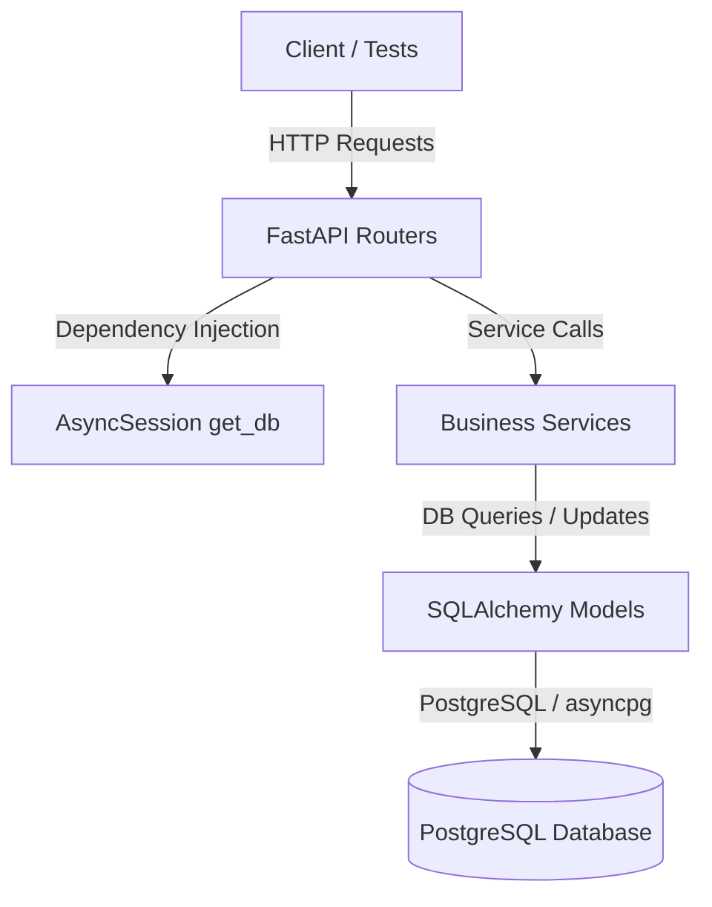

# System Architecture

## 1. Overview
The LifeOS Backend is built with FastAPI, utilizing asynchronous dependency injection to route API requests to dedicated business services. It uses SQLAlchemy (with `asyncpg`) to interact with a PostgreSQL database.

## 2. Core Service Components
The backend divides business logic into service-oriented modules located in `app/services/`:
* **`user_svc.py`**: Handles registration (with BCrypt password hashing), login credentials authentication, and JWT token issuance (30-minute expiration).
* **`plan_svc.py`**: Manages habit/plan CRUD operations and plan activation/deactivation.
* **`execution_svc.py`**: Coordinates daily log initialization, filters habits based on weekday/weekend schedules, and records completions.
* **`scoring_svc.py`**: Calculates point updates (with daily floor controls) and manages user streak increments/resets and rank progressions.

## 3. Data Lifecycle & Key Mechanics

### Plan Activation
* **Endpoint**: `POST /api/v1/plans/{plan_id}/activate`
* **Mechanics**: When a user activates a plan, the system deactivates their currently active plan by setting its `end_date = local_today` and `active = False`. It then registers a new `UserPlan` record with `start_date = local_today` and `active = True`.
* **Constraint**: A unique constraint (`uix_one_active_plan`) ensures that a user can have at most one active plan on any given date.

### Log Initialization & Auto-Backfill
* **Endpoint**: `GET /api/v1/today/`
* **Mechanics**:
  1. Computes the user's local date using their registered timezone.
  2. Runs **Auto-Backfill**: Sweeps for any unprocessed dates between the user's `last_processed_date` (or the earliest log date) and yesterday (bounded to a maximum of 7 days to prevent performance bottlenecks). It programmatically runs `scoring_svc.process_day` for each missed day in chronological order.
  3. Initializes today's logs: Fetches all `PlanHabit` mappings for the active plan.
  4. Filters habits by `day_config` weekdays/weekends:
     * If `day_config == "weekdays"` and today is Saturday/Sunday, the habit is skipped.
     * If `day_config == "weekends"` and today is Monday-Friday, the habit is skipped.
  5. Inserts initial logs into `daily_logs` with a status of `"pending"` and `awarded_points = 0`.
* **Stability**: Log entries capture snapshots of `snapshot_base_score` and habit details at creation time. If a habit's definition changes later, historical scores remain unaffected.

### Daily Processing & Streak Engine
* **Endpoint**: `POST /api/v1/today/process` (and triggered during auto-backfill)
* **Mechanics**:
  1. Transitions any remaining `"pending"` daily logs to `"missed"`.
  2. Evaluates the day's performance:
     * **Completion**: Awarded base points (or 50% for late completions).
     * **Miss**: Deducts 50% of the base score (`awarded_points = -(base_score // 2)`).
  3. Updates point aggregates in `UserStat` and `UserPlanStat`. A strict floor prevents total points from dropping below zero (`max(0, points + total_change)`).
  4. Calculates Streaks:
     * If **any** task of the day is `"missed"`, the current streak is reset to `0`.
     * If **all** tasks of the day are `"done"`, and there is at least one task scheduled, the current streak is incremented by `1`.
     * If no tasks were scheduled for the day, it is treated as a neutral day (no change to streak).

## 4. Database Concurrency & Testing
* **Concurrency Handling**: Concurrency tests verify that multiple parallel requests to activate a plan or complete a habit do not bypass constraints.
* **Connection Pooling**: To resolve `RuntimeError: Queue is bound to a different event loop` issues in test suites using `pytest-asyncio`'s multiple event loops, the database engine is configured to use `NullPool` during testing. This forces connection disposal rather than recycling across different loops.

