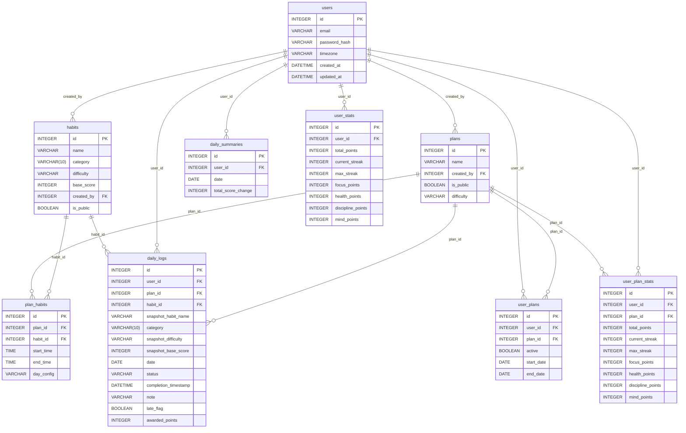

# Database Relationship Graph

```mermaid
erDiagram
    users {
        INTEGER id PK
        VARCHAR email 
        VARCHAR password_hash 
        VARCHAR timezone 
        DATETIME created_at 
        DATETIME updated_at 
    }
    habits {
        INTEGER id PK
        VARCHAR name 
        VARCHAR(10) category 
        VARCHAR difficulty 
        INTEGER base_score 
        INTEGER created_by FK
        BOOLEAN is_public 
    }
    plans {
        INTEGER id PK
        VARCHAR name 
        INTEGER created_by FK
        BOOLEAN is_public 
        VARCHAR difficulty 
    }
    plan_habits {
        INTEGER id PK
        INTEGER plan_id FK
        INTEGER habit_id FK
        TIME start_time 
        TIME end_time 
        VARCHAR day_config 
    }
    user_plans {
        INTEGER id PK
        INTEGER user_id FK
        INTEGER plan_id FK
        BOOLEAN active 
        DATE start_date 
        DATE end_date 
    }
    daily_logs {
        INTEGER id PK
        INTEGER user_id FK
        INTEGER plan_id FK
        INTEGER habit_id FK
        VARCHAR snapshot_habit_name 
        VARCHAR(10) category 
        VARCHAR snapshot_difficulty 
        INTEGER snapshot_base_score 
        DATE date 
        VARCHAR status 
        DATETIME completion_timestamp 
        VARCHAR note 
        BOOLEAN late_flag 
        INTEGER awarded_points 
    }
    daily_summaries {
        INTEGER id PK
        INTEGER user_id FK
        DATE date 
        INTEGER total_score_change 
    }
    user_stats {
        INTEGER id PK
        INTEGER user_id FK
        INTEGER total_points 
        INTEGER current_streak 
        INTEGER max_streak 
        INTEGER focus_points 
        INTEGER health_points 
        INTEGER discipline_points 
        INTEGER mind_points 
    }
    user_plan_stats {
        INTEGER id PK
        INTEGER user_id FK
        INTEGER plan_id FK
        INTEGER total_points 
        INTEGER current_streak 
        INTEGER max_streak 
        INTEGER focus_points 
        INTEGER health_points 
        INTEGER discipline_points 
        INTEGER mind_points 
    }

    users ||--o{ habits : "created_by"
    users ||--o{ plans : "created_by"
    habits ||--o{ plan_habits : "habit_id"
    plans ||--o{ plan_habits : "plan_id"
    plans ||--o{ user_plans : "plan_id"
    users ||--o{ user_plans : "user_id"
    plans ||--o{ daily_logs : "plan_id"
    users ||--o{ daily_logs : "user_id"
    habits ||--o{ daily_logs : "habit_id"
    users ||--o{ daily_summaries : "user_id"
    users ||--o{ user_stats : "user_id"
    users ||--o{ user_plan_stats : "user_id"
    plans ||--o{ user_plan_stats : "plan_id"
```
